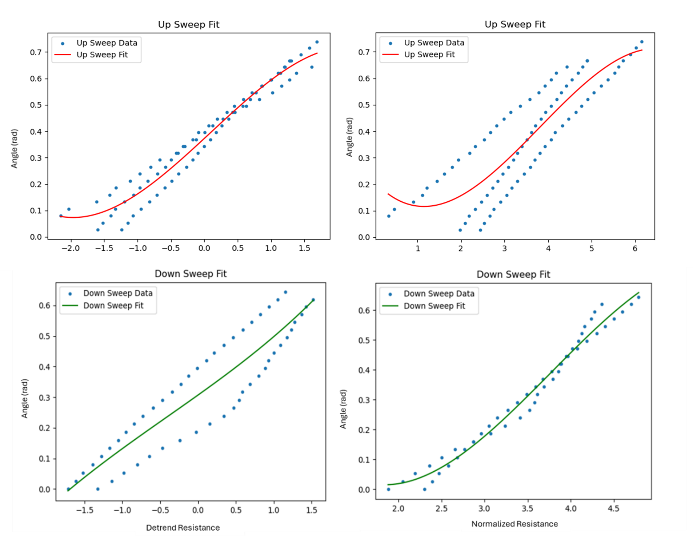

# Flexible Strain Gauge Sensors Using 3D Printed Filaments for Soft Robotic Applications

This repository contains the design files, software, and documentation for a project focused on developing flexible strain gauge sensors using 3D printed conductive filaments. The project aims to create customizable sensors for soft robotic applications, complete with a custom PCB for signal conditioning and data acquisition.

## Table of Contents
1.  [Project Overview](#1-project-overview)
2.  [Theoretical Background](#2-theoretical-background)
    * [Strain Gauge Operation](#21-strain-gauge-operation)
    * [Electrically Conductive Elastomers](#22-electrically-conductive-elastomers)
    * [Wheatstone Bridge](#23-wheatstone-bridge)
3.  [Hardware Implementation](#3-hardware-implementation)
    * [3D Printed Strain Sensor Design](#31-3d-printed-strain-sensor-design)
    * [Custom PCB Design](#32-custom-pcb-design)
4.  [Software and Data Processing](#4-software-and-data-processing)
    * [Data Acquisition](#41-data-acquisition)
    * [Bending Angle Calculation](#42-bending-angle-calculation)
    * [Data Pre- and Post-Processing](#43-data-pre--and-post-processing)
5.  [Results](#5-results)
    * [PCB Performance](#51-pcb-performance)
    * [Sensor Data Analysis](#52-sensor-data-analysis)
    * [Correlation and Prediction](#53-correlation-and-prediction)
6.  [Conclusion & Future Work](#6-conclusion--future-work)
7.  [Repository Contents](#7-repository-contents)

---

## 1. Project Overview

The primary goal of this project is to investigate the feasibility of creating highly customizable and flexible strain gauge sensors using consumer-grade 3D printing technology. These sensors are intended for soft robotics, where monitoring deformation of soft structures is essential.

The project encompasses:
* **Design and Fabrication:** Creating a robust and reliable strain sensor by 3D printing with conductive thermoplastic filaments.
* **Signal Conditioning:** Designing and manufacturing a custom Printed Circuit Board (PCB) to accurately measure the small resistance changes from the sensor.
* **Data Acquisition and Analysis:** Developing a system to capture, process, and interpret the sensor data to correlate it with physical deformation (bending angle).

---

## 2. Theoretical Background

### 2.1 Strain Gauge Operation

A strain gauge functions based on the principle of piezoresistivity: the electrical resistance of a material changes when it is subjected to mechanical deformation (strain). The resistance (R) of a conductor is defined by its geometry and material resistivity ($\rho$):

$R = \frac{\rho L}{A}$

Where:
* `L` is the length of the conductor.
* `A` is its cross-sectional area.

When the material is stretched, its length `L` increases and its cross-sectional area `A` decreases, leading to an increase in resistance. The sensitivity of a strain gauge to strain ($\epsilon$) is quantified by the **Gauge Factor (GF)**:

$GF = \frac{\Delta R/R}{\epsilon_a} = 1 + 2v + \frac{\Delta\rho/\rho}{\epsilon_a}$

Where:
* $\Delta R/R$ is the fractional change in resistance.
* $\epsilon_a$ is the axial strain.
* `v` is the Poisson's ratio of the material.
* The term $\frac{\Delta\rho/\rho}{\epsilon_a}$ represents the change in resistivity with strain (the piezoresistive effect). For many metals, this effect is negligible, but for semiconductor-based sensors and the conductive elastomers used here, it is significant and leads to a much higher Gauge Factor.

### 2.2 Electrically Conductive Elastomers

The conductive filament used in this project (a conductive AMOLEN PLA) behaves similarly to an Electrically Conductive Rubber (ECR). These materials are composites made by embedding conductive fillers (like carbon black) into a polymer matrix.

Their conductivity arises from the network of conductive particles. When the material is stretched, the distance between these particles increases, causing a significant change in resistivity. This piezoresistive behavior makes them highly sensitive to strain, with a Gauge Factor much higher than traditional metallic foil gauges. This high sensitivity is ideal for detecting the subtle deformations in soft robotics.

### 2.3 Wheatstone Bridge

To measure the small changes in resistance from the strain gauge accurately, a **Wheatstone bridge** circuit is used.

The bridge consists of four resistors. The strain gauge ($R_{sensor}$) is placed as one of these resistors. The output voltage ($V_O$) is given by:

$V_O = (\frac{R_2}{R_1 + R_2} - \frac{R_{sensor}}{R_3 + R_{sensor}}) \cdot V_{in}$

Key advantages of using a Wheatstone bridge are:
* **High Sensitivity:** It can detect very small changes in resistance.
* **Temperature Compensation:** If all resistors in the bridge are exposed to the same temperature, any temperature-induced resistance changes will cancel each other out, making the output signal stable across varying thermal conditions. This is crucial for reliable measurements.
* **Output Proportional to Resistance Change:** The output voltage is directly related to the change in the sensor's resistance, not the absolute input voltage, which reduces measurement errors from power supply fluctuations.

---

## 3. Hardware Implementation

### 3.1 3D Printed Strain Sensor Design

The goal was to create a sensor with a nominal resistance of approximately **43 kΩ** to match the other resistors in the Wheatstone bridge. After numerous iterations, a final serpentine geometry was developed.

**Design Choices and Rationale:**
* **Serpentine Pattern:** This layout distributes bending stress across multiple segments instead of concentrating it in one location. This significantly improves the sensor's durability and the consistency of its resistance measurements during repeated bending cycles compared to a simple rectangular design.
* **Thickness:** A thickness of 1 mm was found to be the practical minimum. Thinner designs were less reliable and more prone to measurement drift.
* **Bending Axis:** The sensor is designed to be bent perpendicular to its main axis (the x-axis in the diagram), as this orientation provides the most stable and accurate resistance readings.

### 3.2 Custom PCB Design

A custom PCB was designed in Altium Designer to amplify and condition the signal from the Wheatstone bridge.

**Key Components and Features:**
* **Wheatstone Bridge:** The board includes three high-precision **RG2012P-433-B-T1** resistors (43 kΩ) to form the bridge with the external 3D printed sensor.
* **Differential Amplifier:** A **MAX4208AUA+** instrumentation amplifier is used to amplify the small differential voltage from the bridge. This amplifier was chosen for its:
  * **High Precision and Low Noise:** Essential for amplifying millivolt-level signals accurately.
  * **High Common-Mode Rejection Ratio (CMRR):** Rejects noise that is common to both inputs, ensuring that only the true signal from the strain is amplified.
  * **Stable Gain:** The gain is set by an external resistor network, allowing for predictable and stable amplification.
* **Connections:** The board provides pins for power (VCC, GND), the amplified output voltage (OUT), and screw terminals to securely connect the 3D printed sensor.

---

## 4. Software and Data Processing

### 4.1 Data Acquisition

The data acquisition system is orchestrated as follows:
1.  The custom PCB outputs an amplified analog voltage ($V_{out}$).
2.  An **Arduino Mega** reads this analog voltage via one of its ADC pins.
3.  The Arduino transmits the digital voltage readings to a PC via serial communication for logging and real-time analysis.

### 4.2 Bending Angle Calculation

To create a correlation model, the electrical data needed to be mapped to a physical ground truth. The sensor's bending angle ($\theta$) was calculated from top-down video recordings of the sensor bending.

Assuming the bend forms an isosceles triangle, the angle is calculated using trigonometry:
* A base of known length ($l_{tot}$) is established.
* The vertical height (`h`) from the base to the apex of the bend is measured from the video frames.
* The angle $\theta$ is calculated as:

$\theta = 2 \cdot \arctan(\frac{h}{l_{tot}/2})$

This process was done manually by synchronizing the video frames with the logged resistance data.

### 4.3 Data Pre- and Post-Processing

Raw sensor data is noisy and requires significant processing to be useful. The Python-based processing pipeline includes several key steps:

1.  **Oversampling and Filtering:** On the Arduino, multiple ADC readings are averaged (oversampling) to reduce noise. This is followed by a first-order IIR (Infinite Impulse Response) low-pass filter to smooth the signal further.
    `filteredVoltage[n] = a * filteredVoltage[n-1] + (1 - a) * current_sample`

2.  **Resistance Calculation:** The filtered voltage is used to calculate the sensor's resistance based on the known amplifier gain and Wheatstone bridge equations.

3.  **Normalization (Robust Scaling):** The raw resistance data varies between sensors. To make them comparable, the data is normalized using the median and interquartile range (IQR). This method is robust to outliers and baseline shifts.

4.  **Detrending to Handle Hysteresis:** The sensor exhibited significant **hysteresis**, meaning the resistance at a given angle was different depending on whether the sensor had been bent (upsweep) since the relaxation time was long, and the inner strains and therefore the Resistance did not come back to the basis values even after some time. So the following bends upwards were always offset slightly. To correct for this, the `scipy.signal.detrend` function was applied to the upsweep data. This removes the linear trend caused by the memory effect, allowing a single polynomial model to fit the data better. The downsweep data did not require detrending.

5.  **Polynomial Correlation:** Two separate polynomial fit models were created: one for the detrended upsweep data and one for the normalized downsweep data. These models map resistance values to the calculated bending angle.

6.  **Prediction Smoothing:** The final angle predictions, which switch between the two models, are smoothed using a rolling average (with a window of 50 samples) to eliminate noise from model transitions and other sources.

---

## 5. Results

### 5.1 PCB Performance

The custom PCB performed reliably, but the assembly process revealed several design flaws that serve as lessons for future iterations:
* **Component Footprint Mismatches:** Some footprints in the Altium library did not perfectly match the physical components.
* **BOM Mismatches:** The resistor alternatives from the fabrication service (JLCPCB) required careful verification.
* **Labeling Errors:** The VCC and GND pin labels were accidentally swapped in the design file.
* **Datasheet Misinterpretation:** A misunderstanding of the amplifier's datasheet required an extra resistor to be soldered on manually (Parallel to C1) to achieve the correct gain.

Despite these issues, the final assembled board successfully amplified the sensor signals, validating the overall electronic design.

### 5.2 Sensor Data Analysis

* **High Sensitivity:** The sensor showed a resistance change of approximately 30% for a 4-8% strain, indicating a high Gauge Factor. This is highly beneficial for soft robotics applications where high sensitivity is needed.
* **Long Relaxation Time:** A significant drawback is the sensor's long resistance relaxation time. After being deformed, the sensor did not fully return to its baseline resistance, even after three minutes. This indicates a material memory effect.
* **Variability:** Sensors printed under identical conditions showed significant variation in their baseline resistance (from 30 kΩ to 43 kΩ). Normalization was crucial to handle this.

### 5.3 Correlation and Prediction

The data processing pipeline was highly effective.
* **Hysteresis Compensation:** Creating separate models for upsweep (with detrending) and downsweep movements successfully accounted for the hysteresis.
* **Accurate Prediction:** The final smoothed predictions closely matched the actual measured angle values, with a low Mean Squared Error (MSE). The `upsweep` model had an average MSE of **0.00178** and the `downsweep` model had an average MSE of **0.00073**. This confirms the robustness of the correlation approach across different sensors and movement patterns.

---

## 6. Conclusion & Future Work

This project successfully demonstrated the potential of using 3D printed conductive filaments to create flexible strain gauge sensors for soft robotics. The combination of a custom-designed sensor, a dedicated PCB, and a robust data processing pipeline resulted in a system capable of reliably measuring bending angles.

**Key Takeaways & Limitations:**
* **Successes:** The serpentine sensor design is durable, the Wheatstone bridge with the MAX4208AUA+ amplifier provides accurate measurements, and the data processing strategy effectively handles noise and hysteresis.
* **Limitations:**
  * **Sensor Stiffness:** The final sensor design is still somewhat too stiff for certain highly flexible soft robotic applications.
  * **Material Hysteresis & Relaxation:** The long relaxation time is a significant material limitation that could affect dynamic measurements.
  * **PCB Design Flaws:** The manual fixes required during PCB assembly highlight the need for more rigorous design verification.

**Future Work:**
* **Improve Flexibility:** Experiment with different materials (e.g., filaments with higher rubber content) or design geometries (e.g., thinner traces, different patterns) to reduce sensor stiffness.
* **Automate Gain Control:** Redesign the PCB to include a digital potentiometer, allowing the amplifier's gain to be adjusted programmatically to accommodate different sensors.
* **Improve Angle Tracking:** Replace the manual video-based angle calculation with an automated image processing technique for more efficient and accurate model training.
* **Explore Advanced Materials:** Investigate filaments infused with graphene or carbon nanotubes (CNTs) to potentially improve sensitivity and reduce relaxation time.

---

## 7. Repository Contents

* **/PCB/**: Contains the Altium Designer project files, Gerbers, and Bill of Materials (BOM) for the custom PCB.
* **/STL/**: Contains the STL file for the final 3D printed strain gauge sensor.
* **/Code/**:
  * `FlexDMS3D_Arduino`: The Arduino platform.io project for reading sensor data and sending it over serial. To communicate with the board you need to use SerialCommandHandler, meanning you send to the board
  through serial !connect (the ending needs to be \r) or similar commands.
  * `FlexDMS3D_Arduino/Python/CorrelationR_Deg.py`: The Python script for processing the raw data, performing the correlation, and generating the prediction models.
Other python scripts are also available for different tests. (Statistical and plotting)

## 8. References

1.	Dally, J.W., & Riley, W.F. (1991). Experimental Stress Analysis (4th ed.). McGraw-Hill. 
2.	Lee, C., Yoo, J., & Kim, S. (2017). "Flexible and Stretchable Strain Sensors Based on Electrically Conductive Elastomers." Advanced Materials, 29(18), 1606679.
3.	Kester, W. (1999). Practical Design Techniques for Sensor Signal Conditioning – Section 2: Bridge Circuits. Analog Devices. Retrieved from https://www.analog.com/media/en/training-seminars/design-handbooks/Practical-Design-Techniques-Sensor-Signal/Section2.PDF. 
4.	Truby, R. L., & Lewis, J. A. (2016). "Printing soft matter in three dimensions." Nature, 540(7633), 371-378. 
5.	Ko, Y. D., & Kang, T. G. (2018). "Numerical simulation and experimental verification of flexible strain sensors." Sensors and Actuators A: Physical, 274, 155-163.
6.	Zhang, Y., & Zhao, X. (2022). "3D Printed Strain Sensors for Soft Robotics." Journal of Applied Polymer Science, 139(8), 51587. 
7.	Research Article in Robotics (2023). Robotics, 13(1), 103. 
8.	M. Shimojo, A. Namiki, M. Ishikawa, R. Makino, K. Mabuchi, "IEEE Sens. J. 2004, 4, 589."
9.	Analog Devices. (2023). MAX4208AUA+ Datasheet: Precision, Low-Offset, Low-Drift, Micropower, Rail-to-Rail Instrumentation Amplifier. Maxim Integrated (Analog Devices). Retrieved from https://www.analog.com/media/en/technical-documentation/data-sheets/MAX4208-MAX4209.pdf.D. Kim, N. Lu, R. Ghaffari, et al., "Nat. Mater. 2011, 10, 316."
10.	Cimbala, J. M. (2014, September 17). Taguchi Orthogonal Arrays. Penn State University. Retrieved July 1, 2024, from https://www.me.psu.edu/cimbala/me345/Lectures/Taguchi_orthogonal_arrays.pdf
11.	Beckwith, T. G. (1982). Mechanical Measurements (3d ed). Addison-Wesley Pub. Co
12.	Qi, H., & Boyce, M. (2004). Stress–strain behavior of thermoplastic polyurethanes. Mechanics of Materials, 37(8), 817–839. https://doi.org/10.1016/j.mechmat.2004.08.001 
13.	Chambers, D. (2017). Digital image correlation: Advanced Methods and Applications.
14.	Virtanen, P., Gommers, R., Oliphant, T. E., Haberland, M., Reddy, T., Cournapeau, D., & SciPy Contributors. (2020). "SciPy Signal Processing: scipy.signal.detrend." SciPy v1.8.0 Reference Guide. Retrieved from https://docs.scipy.org/doc/scipy/reference/generated/scipy.signal.detrend.html.
15.	Wevolver. (2021). "Comparison of PLA, ABS, and PETG Filaments for 3D Printing." Wevolver Technical Articles. Retrieved from https://www.wevolver.com/article/comparison-of-pla-abs-and-petg-filaments-for-3d-printing. 
16.	Nasser, N., & Eshraghi, S. (2019). "Mechanical Properties of 3D Printed Polymers and Their Composites." Polymers, 11(12), 2056. DOI: 10.3390/polym11122056. Retrieved from https://pmc.ncbi.nlm.nih.gov/articles/PMC6926899. 
17.	Toner Plastics. (2023). "Tensile Testing Results of Toner Plastics 3D Filament." Toner Plastics Technical Reports. Retrieved from https://tonerplastics.com/tesile-testing-results-of-toner-plastics-3d-filament/. 
18.	 Costa, A. R. M., Luna, C. B. B., Nascimento, E. P., Ferreira, E. S. B., Costa, C. M., & Almeida, Y. M. B. (2023). "Tailoring PLA/ABS Blends Compatibilized with SEBS-g-MA through Annealing Heat Treatment." Polymers, 15(16), 3434. DOI: 10.3390/polym15163434. 
19.	 Hampel, F. R. (2001). Robust statistics: A brief introduction and overview. In Research Report/Seminar für Statistik, Eidgenössische Technische Hochschule (ETH) (Vol. 94). Seminar für Statistik, Eidgenössische Technische Hochschule.
